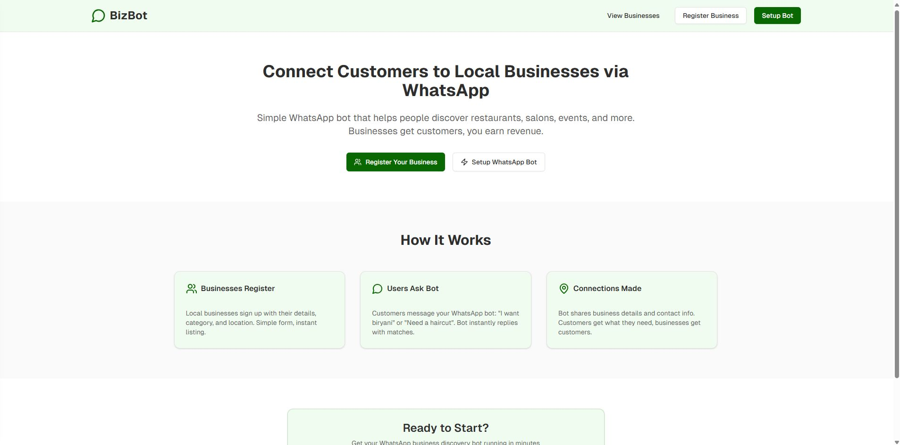
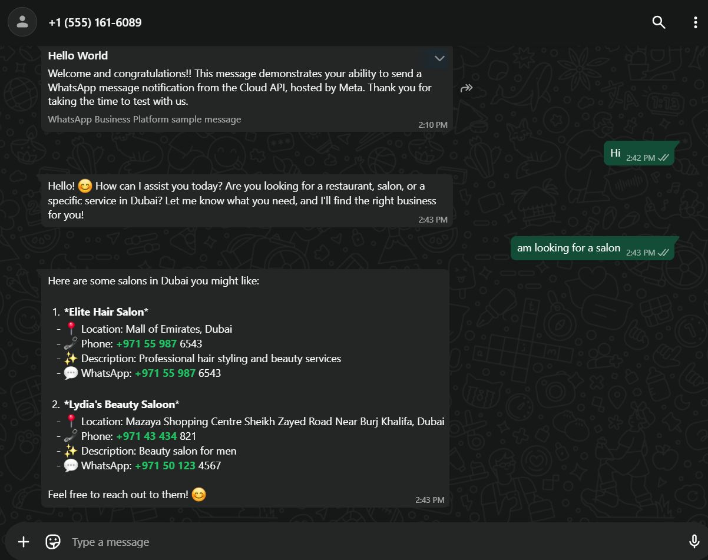
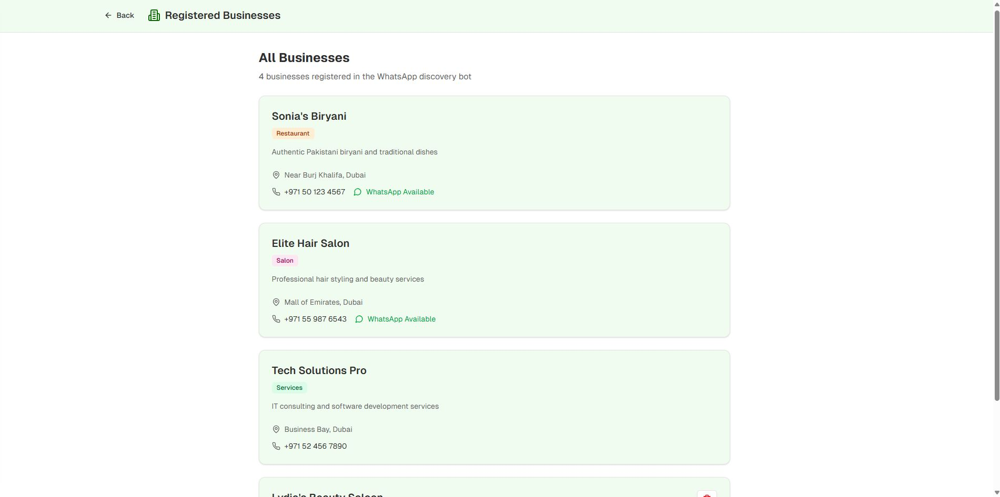

# 💬 BizBot – WhatsApp Business Connector
> Revolutionizing how customers discover local businesses through WhatsApp.

BizBot is an AI-driven WhatsApp integration that helps people find nearby restaurants, salons, services, and events — while giving small businesses a simple way to reach and engage with customers directly.

---

## 🎥 Demo
👉 [Watch the Prototype Demonstration](https://lnkd.in/eqYSyQrz)

---

## 🚀 Features
✅ **AI-Powered Discovery** – Users simply message the bot (e.g., “I need a salon”) and instantly get relevant results.  
✅ **Business Visibility** – Local businesses register easily via a web dashboard.  
✅ **WhatsApp Integration** – Built with Meta’s Cloud API for smooth two-way messaging.  
✅ **Revenue Model** – Business sign-ups power platform growth and sustainability.  
✅ **Seamless UX** – Quick setup, intuitive design, and real-time response system.  

---

## 🧠 How It Works
1. **Businesses Register**  
   They add their details, category, and contact info via the dashboard.
2. **Users Ask Bot**  
   Customers send a WhatsApp message (like “I’m looking for a biryani place”).  
3. **Connections Made**  
   The bot instantly replies with relevant business matches and contact info.

---

## 🖥️ Tech Stack
- **Frontend:** React.js + TailwindCSS  
- **Backend:** Node.js + Express  
- **Database:** MongoDB  
- **Messaging API:** WhatsApp Cloud API (Meta)  
- **AI Logic:** NLP-based keyword and category matching  

---

## 📸 Screenshots
| Web Dashboard | WhatsApp Chat | Business Registration |
|---------------|---------------|------------------------|
|  |  |  |

---

## ⚙️ Setup Instructions
1. Clone the repo  
   ```bash
   git clone https://github.com/<your-username>/BizBot-WhatsApp-Business-Connector.git
   cd BizBot-WhatsApp-Business-Connector
Install dependencies

bash
Copy code
npm install
Configure environment variables in .env

bash
Copy code
WHATSAPP_TOKEN=your_meta_cloud_token
VERIFY_TOKEN=your_verification_token
MONGO_URI=your_mongo_connection
Start the app

bash
Copy code
npm run dev
📈 Vision
To empower small and local businesses with affordable, AI-powered customer acquisition through one of the world’s most popular messaging platforms — WhatsApp.

🧑‍💻 Author
[Hassan Ali]
Building AI-driven automation tools that bridge digital gaps 🌍
https://www.linkedin.com/in/hassanxl

⭐ Don’t forget to star this repo if you like the concept!
